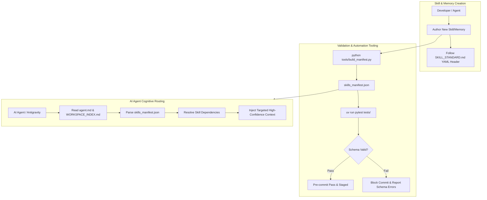

# 🧠 Master Skills Framework & Cognitive Memory Protocol

A centralized, standardized repository of agentic skills, architectural patterns, immutable knowledge bases, formal verification rules, and automated cognitive manifests.

---

## 📌 Project Overview

The **Master Skills** ecosystem establishes the operating standards and long-term memory for AI agents (Claude Opus 4.6, Antigravity, Cursor, Codex) working across this workspace. Every capability is codified as a standardized markdown document with YAML frontmatter, dependency resolution graph, and strict schema validation.

- **Primary Machine Index:** [`skills_manifest.json`](skills_manifest.json) — Auto-generated JSON manifest mapping skills, tags, categories, and dependency trees.
- **Human-Readable Tree:** [`SKILL_TREE.md`](SKILL_TREE.md) — Categorized hierarchical view of all skills.
- **Schema & Protocols:** [`SKILL_STANDARD.md`](SKILL_STANDARD.md) and [`CORE_MEMORY_PROTOCOL.md`](CORE_MEMORY_PROTOCOL.md).

---

## 📂 Domain Taxonomy

| Directory | Scope | Purpose |
| :--- | :--- | :--- |
| [`skills/`](skills/) | **Actionable Engineering Workflows** | Backend (Python, Rust, Flask), Frontend (Subgrid, Temporal API, WebGPU), Infra (Docker, OIDC CI/CD, MAS Swarms), DBs (Postgres, BigQuery, Redis), Media & Documents. |
| [`knowledgebase/`](knowledgebase/) | **Architectural References & Facts** | Hexagonal Architecture, PACELC, Cell-based design, OWASP Agentic Top 10, FinOps unit economics. |
| [`testing/`](testing/) | **Validation Rules & Formal Methods** | TLA+ mathematical verification, Pytest elite fixtures, Playwright e2e, agentic security audits. |
| [`game_design/`](game_design/) | **Game Mechanics & Economy** | Roguelike scoring, run economy balancing, narrative event trees, social deduction systems. |
| [`ai_infrastructure/`](ai_infrastructure/) | **AI Toolchains & RAG** | Product specification chains, RAG generation pipelines, prompt engineering harnesses. |
| [`creative_3d/`](creative_3d/) | **3D & Procedural Art** | Blender procedural mesh generation and boolean modeling patterns. |
| [`utilities/`](utilities/) | **Algorithms & Math** | Frequency analysis, continuous event simulation, combinatorial optimization. |
| [`tools/`](tools/) | **Manifest & Validation Tooling** | Manifest generation script ([`build_manifest.py`](tools/build_manifest.py)) and git hooks. |
| [`tests/`](tests/) | **Schema Test Suite** | Automated Pytest schema validator ensuring 100% compliance across all memory files. |

---

## 🏗️ Architecture & Memory Ingestion Pipeline



---

## 🚀 Setup & Execution

### 1. Install Pre-Commit Hooks (Run Once per Clone)
```powershell
git config core.hooksPath tools/hooks
```

### 2. Regenerate Manifest
```powershell
python tools/build_manifest.py
```

### 3. Run Automated Schema Validation
```powershell
uv run pytest tests/
```

---

## 🎯 Active Protocols & Directives

1. **Routing First:** Parse `skills_manifest.json` before performing un-targeted codebase searching.
2. **Deterministic Schemas:** Every new skill requires `name`, `description`, `version`, `category`, and `confidence_score` (0.0 - 1.0).
3. **Cross-Linking:** Use Obsidian-style `[[path/to/file]]` links to connect dependent skills, knowledgebase facts, and testing validators.
